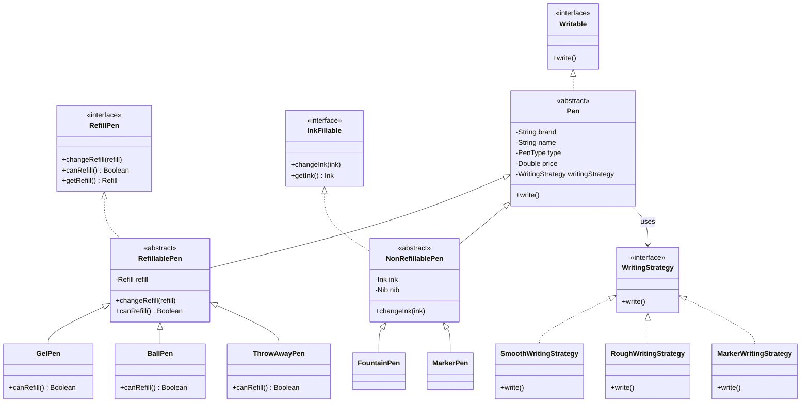

# Pen Design 

### Folder Structure
```
pen-design/
├── .gitignore
├── pom.xml
└── src/
    ├── main/
    │   └── java/
    │       └── com/
    │           └── pen/
    │               ├── Main.java
    │               ├── interfaces/
    │               │   ├── Writable.java
    │               │   ├── RefillPen.java
    │               │   └── InkFillable.java
    │               ├── models/
    │               │   ├── Ink.java
    │               │   ├── InkType.java
    │               │   ├── Nib.java
    │               │   ├── NibType.java
    │               │   ├── PenType.java
    │               │   └── Refill.java
    │               ├── strategies/
    │               │   ├── WritingStrategy.java
    │               │   ├── SmoothWritingStrategy.java
    │               │   ├── RoughWritingStrategy.java
    │               │   └── MarkerWritingStrategy.java
    │               └── pens/
    │                   ├── Pen.java
    │                   ├── refillable/
    │                   │   ├── RefillablePen.java
    │                   │   ├── GelPen.java
    │                   │   ├── BallPen.java
    │                   │   └── ThrowAwayPen.java
    │                   └── nonrefillable/
    │                       ├── NonRefillablePen.java
    │                       ├── FountainPen.java
    │                       └── MarkerPen.java
    └── /
```

# Pen UML Diagram 


